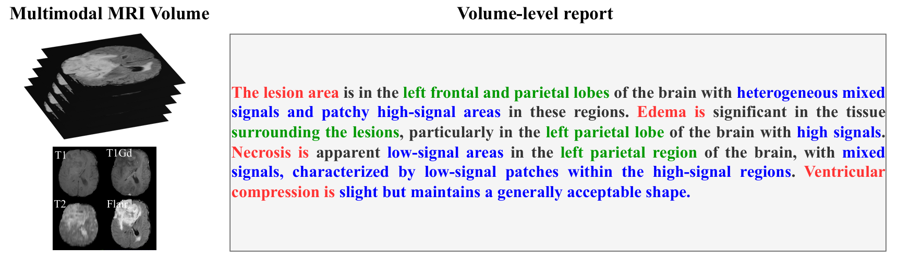
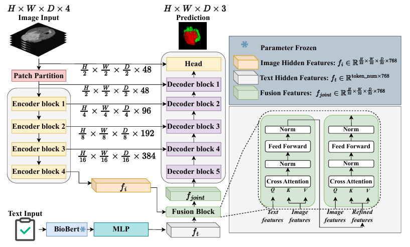

# TextBraTS

A text-image public dataset with novel text-guided 3D brain tumor segmentation.

---

## Introduction

**TextBraTS** is an open-access dataset designed to advance research in text-guided 3D brain tumor segmentation. It includes paired multi-modal brain MRI scans and expertly annotated radiology reports, enabling the development and evaluation of multi-modal deep learning models that bridge vision and language in neuro-oncology.



## Features

- Multi-modal 3D brain MRI scans with expert-annotated segmentation (T1, T1ce, T2, FLAIR) from BraTS20 challenge training set
- Structured radiology reports for each case
- Text-image alignment method for research on multi-modal fusion



## Usage

You can use this dataset for:
- Developing and benchmarking text-guided segmentation models
- Evaluating multi-modal fusion algorithms in medical imaging
- Research in language-driven medical AI

## Installing Dependencies
Run the following commands to set up the environment:
<pre>conda env create -f environment.yml 
pip install git+https://github.com/Project-MONAI/MONAI.git@07de215c </pre>
If you need to activate the environment, use:
<pre>conda activate TextBraTS </pre>

  

## Citation

If you use TextBraTS in your research, please cite:

```bibtex
@inproceedings{shi2025textbrats,
  title = {TextBraTS: Text-Guided Volumetric Brain Tumor Segmentation with Innovative Dataset Development and Fusion Module Exploration},
  author = {Shi, Xiaoyu and Jain, Rahul Kumar and Li, Yinhao and Hou, Ruibo and Cheng, Jingliang and Bai, Jie and Zhao, Guohua and Lin, Lanfen and Xu, Rui and Chen, Yen-wei},
  booktitle = {Proceedings of the International Conference on Medical Image Computing and Computer Assisted Intervention (MICCAI)},
  year = {2025},
  note = {to appear}
}
